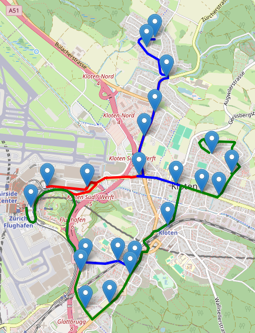

# About 
Dies ist ein kleines GIS-Projekt für eine Buslinienkarte von einer Stadt. Auf ihr sieht man die 3 verschiedene Buslinien, welche ich häufig verwende. Auf der Karte sind verschiedene Haltestellen und Buslinien dargestellt. Wenn man auf diese drauf klickt, sieht man den Namen der Haltestelle/Buslinie.

# Technologien
- **Leaflet** für die Kartenvisualsierung
- **Openrouteservice** für Strassenrouten
- **Node.js** als Mini-Backend für API-Anfragen
- **HTML** für den Browser-View
- **GeoJSON-Daten** für Haltestellen
- **JSON-Daten** für einzelne Verbindungspunkte der Linien


# Features
- Buslinien, dargestellt durch verschiedenfarbige Linien
- Haltestellen, dargestellt durch Marker
- Präzises Rendering der Linien durch ORS (Openrouteservice)
- Skalierbarkeit, beliebig viele Haltestellen/Linien können hinzugefügt werden
- Pop-ups beim Anklicken von Linien, Haltestellen

# Installation/Setup
## 1. Repository klonen:
``` bash
git clone https://github.com/mikeezvz/BusMap.git
cd BusMap
```
## 2. Abhängigkeiten installieren
``` bash
npm install
```
## 3. ```.env``` Datei erstellen mit ORS-API-Key
``` text
ORS_API_KEY=<api-key>
```
## 4. Node-Server starten
``` bash
node server.js
```
## 5. Im Browser öffnen
``` text
http://localhost:3000
```


